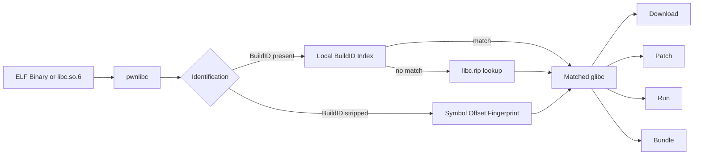
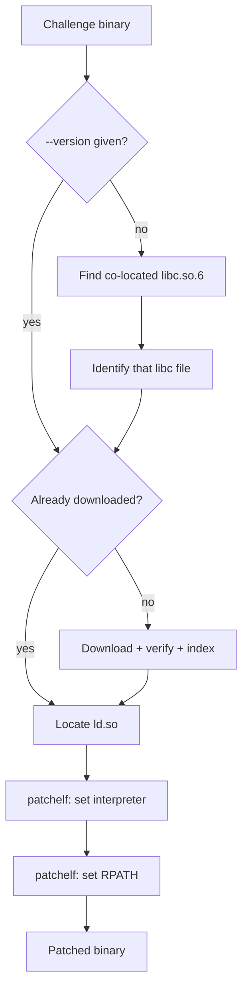
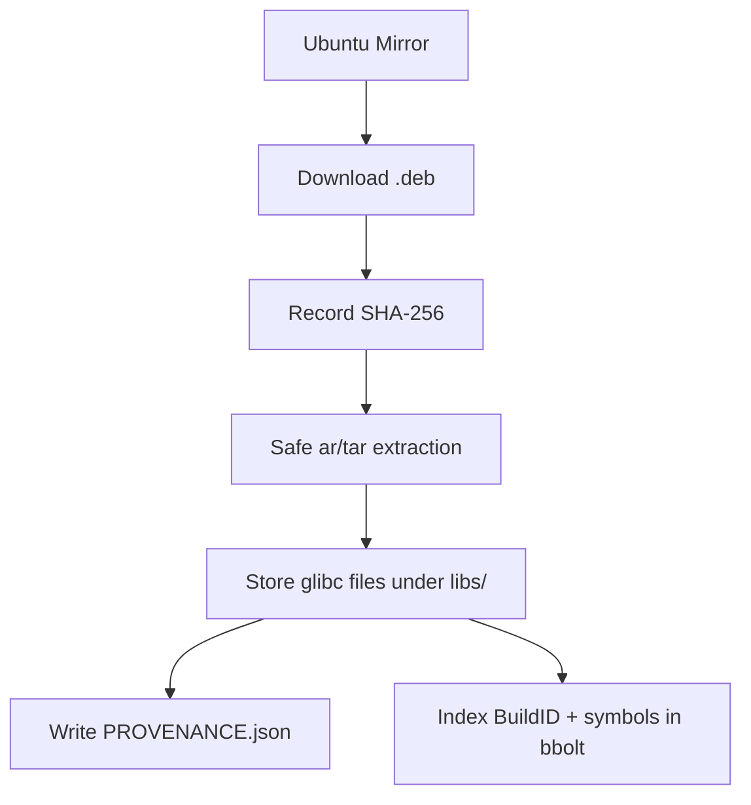

<div align="center">

<pre>
                                  __  _ __
    ____ _      ______  / /_(_) /_  _____
   / __ \ | /| / / __ \/ __/ / __ \/ ___/
  / /_/ / |/ |/ / / / / /_/ / /_/ / /__
 / .___/|__/|__/_/ /_/\__/_/_.___/\___/
/_/
</pre>

### A Docker-first glibc management toolkit for CTF and binary exploitation

Download, identify, compare, patch, build, and reproduce glibc environments.

[](https://github.com/0xCyb3rgh0st/pwnlibc/actions/workflows/ci.yml)
[](https://github.com/0xCyb3rgh0st/pwnlibc/releases)
[](https://github.com/0xCyb3rgh0st/pwnlibc/pkgs/container/pwnlibc)
[](LICENSE)
[](go.mod)

</div>

> [!IMPORTANT]
> `pwnlibc` targets glibc and Linux ELF workflows. Windows users should use Docker Desktop (Linux containers) or WSL2 — there is no native Windows binary support for `patch`/`run`/`build`, which depend on Linux-only tooling (`patchelf`, Docker, ELF interpreters).

## Table of contents

- [Quick demonstration](#quick-demonstration)
- [Why pwnlibc?](#why-pwnlibc)
- [Features](#features)
- [Supported commands](#supported-commands)
- [Installation](#installation)
- [Quick start](#quick-start)
- [Docker usage](#docker-usage)
- [Standalone binary usage](#standalone-binary-usage)
- [Local Docker-based build](#local-docker-based-build)
- [Local release build](#local-release-build)
- [Command examples](#command-examples)
- [How identification works](#how-identification-works)
- [How patching works](#how-patching-works)
- [Architecture](#architecture)
- [Supported platforms](#supported-platforms)
- [Release process](#release-process)
- [Security and provenance](#security-and-provenance)
- [Troubleshooting](#troubleshooting)
- [Contributing](#contributing)
- [License](#license)
- [Acknowledgements](#acknowledgements)

## Quick demonstration

Both transcripts below are real output, captured from the built image
against an actual downloaded glibc 2.31.

```console
$ pwnlibc identify libs/2.31-0ubuntu9.18/amd64/libc.so.6
╭─ glibc identification
│ File         libs/2.31-0ubuntu9.18/amd64/libc.so.6
│ Architecture x86_64
│ BuildID      5792732f783158c66fb4f3756458ca24e46e827d
│ Version      2.31-0ubuntu9.18_amd64
│ Method       buildid_local
│ Confidence   exact
╰─ Match confirmed
```

```console
$ pwnlibc patch workdir/challenge
[*] Inspecting ELF binary
[+] Required glibc identified: 2.31-0ubuntu9.18_amd64
[+] Dynamic loader available locally
[+] RPATH updated
[+] Interpreter updated
[+] Patched binary: workdir/challenge_patched
```

`patch` auto-detects the required glibc from a `libc.so.6` (or similarly
named file) sitting next to the binary — the same convention most CTF
challenges ship in. If none is found, pass `--version` explicitly (see
[How patching works](#how-patching-works)).

## Why pwnlibc?

[glibc-all-in-one](https://github.com/matrix1001/glibc-all-in-one) is a great
reference implementation, but it shells out to `pyelftools`/`readelf`,
downloads sequentially with no checksum verification, and needs a local
Python environment. `pwnlibc` is a clean-room reimplementation of the same
*idea* — not a port of its code — built around three things:

- **No local toolchain, ever.** Build, test, lint, and run all happen through
  Docker. `go build` never has to run on your machine.
- **Reliability.** SHA-256 recorded per download, path-traversal/zip-slip-safe
  extraction, decompression-bomb caps, a per-session mirror circuit breaker,
  and a `PROVENANCE.json` audit trail for every version you pull.
- **Performance.** Native Go `debug/elf` parsing (no subprocess calls to
  `nm`/`readelf`), concurrent mirror racing, and a local `bbolt` index for
  O(1) repeat lookups.

## Features

| Feature | Description |
|---|---|
| Mirror | Synchronise available glibc package metadata across four Ubuntu mirrors |
| Search | Search glibc versions, local symbols, and reverse symbol/BuildID matches |
| Download | Download Ubuntu glibc packages with recorded checksums and provenance |
| Identify | Detect glibc via BuildID (local index or libc.rip) or symbol-offset fingerprinting |
| Diff | Compare symbols and security attributes (RELRO/NX/Canary/PIE/RUNPATH) between versions |
| Build | Build glibc from source inside a period-correct Ubuntu container |
| Vuln | Show curated known-CVE information for a version |
| Patch | Patch an ELF's interpreter and RPATH, pwninit-style |
| Run | Reproduce a challenge inside a disposable container with gdb |
| Bundle | Package the local glibc cache for air-gapped transport |
| Doctor | Check Docker reachability, disk space, mirror reachability, and index health |

## Supported commands

| Command | Purpose |
|---|---|
| [`mirror`](#command-examples) | Update or list mirror metadata |
| [`search`](#command-examples) | Search available glibc packages, local symbols, or libc.rip |
| [`download`](#command-examples) | Download and record a glibc package |
| [`identify`](#how-identification-works) | Identify a glibc file |
| [`diff`](#command-examples) | Compare two glibc versions |
| [`build`](#command-examples) | Build glibc inside Docker |
| [`vuln`](#command-examples) | Show curated vulnerability information |
| [`patch`](#how-patching-works) | Patch an ELF binary |
| [`run`](#command-examples) | Start a disposable reproduction environment |
| [`bundle`](#command-examples) | Create or restore a portable glibc bundle |
| [`doctor`](#command-examples) | Check required tools and configuration |
| `version` | Print the pwnlibc version |
| `banner` | Print the pwnlibc banner |

Every command supports `--json` for scripting, and `--no-color`/`--no-banner`
for plain output.

## Installation

### Docker (recommended)

Recommended for Windows, Linux, and anyone who doesn't want local
dependencies — `patchelf` and the tooling `build`/`run` need ship inside the
image.

```bash
docker pull ghcr.io/0xcyb3rgh0st/pwnlibc:latest
docker run --rm ghcr.io/0xcyb3rgh0st/pwnlibc:latest version
```

Day-to-day usage goes through the wrapper scripts instead of raw `docker run`
— see [Quick start](#quick-start).

### Standalone binary (Linux / macOS)

Every tagged release publishes cross-compiled archives (Linux/macOS,
amd64/arm64) with checksums to
[GitHub Releases](https://github.com/0xCyb3rgh0st/pwnlibc/releases). Download
the archive for your platform, extract it, and run the binary directly.
`patch` needs `patchelf` on your `PATH`; `build`/`run` need a local Docker
daemon — neither ships inside a bare binary.

> [!WARNING]
> There is no native Windows binary. `patch`/`run`/`build` depend on Linux
> ELF tooling and Docker-in-Docker; use the Docker image or WSL2 on Windows.

### `go install`

```bash
go install github.com/0xCyb3rgh0st/pwnlibc/cmd/pwnlibc@latest
```

Same caveat as the standalone binaries: `patchelf`/`docker` need to already
be on your machine for `patch`/`build`/`run`.

## Quick start

```sh
git clone https://github.com/0xCyb3rgh0st/pwnlibc.git
cd pwnlibc
./pwnlibc.sh mirror update          # or ./pwnlibc.ps1 on Windows
./pwnlibc.sh download 2.31-0ubuntu9.18_amd64
./pwnlibc.sh identify libs/2.31-0ubuntu9.18/amd64/libc.so.6
```

The first run builds the `pwnlibc:latest` image; after that, every command is
`docker compose run --rm cli <args>` under the hood. Downloaded glibc
versions land in `./libs`, persisted on the host. Drop challenge binaries
into `./workdir` before running `patch`/`run` against them — those two
commands launch *nested* containers via the host Docker socket and can only
reach files under `./libs` or `./workdir` (see
[Architecture](#architecture)).

## Docker usage

Linux / macOS:

```bash
docker run --rm \
  -v "$(pwd):/work" \
  ghcr.io/0xcyb3rgh0st/pwnlibc:latest \
  identify /work/libc.so.6
```

Windows PowerShell:

```powershell
docker run --rm `
  -v "${PWD}:/work" `
  ghcr.io/0xcyb3rgh0st/pwnlibc:latest `
  identify /work/libc.so.6
```

For anything beyond a single one-shot command (i.e. everyday use), prefer the
`pwnlibc.sh`/`pwnlibc.ps1` wrappers from [Quick start](#quick-start) — they
handle the `./libs`/`./workdir` volume mounts and the `build-src` profile for
you.

## Standalone binary usage

```bash
tar xzf pwnlibc_<version>_linux_amd64.tar.gz
./pwnlibc doctor
./pwnlibc identify ./libc.so.6
```

## Local Docker-based build

```bash
git clone https://github.com/0xCyb3rgh0st/pwnlibc.git
cd pwnlibc
make build   # docker compose build cli
make test    # go vet + go test, in a container
make lint    # golangci-lint, in a container
```

Only Docker and Git are required — this is the same containerized workflow
CI uses.

## Local release build

Cross-compiling the release archives locally (what CI's `release-binaries`
job runs) uses [GoReleaser](https://goreleaser.com/) via Docker, so it still
doesn't need a local Go install:

```bash
docker run --rm -v "$(pwd):/src" -w /src goreleaser/goreleaser:latest \
  release --snapshot --clean --skip=publish
```

Artifacts land in `./dist/`.

## Command examples

Every transcript below is real output captured from the built image, not
hand-typed.

```console
$ pwnlibc mirror update
[*] Refreshing mirrors
[+] Indexed 1967 packages across 4 mirrors
```

```console
$ pwnlibc search 2.31
2.31-0ubuntu9_amd64          arch=amd64    mirrors=tuna,ustc,ubuntu-archive
2.31-0ubuntu9_i386           arch=i386     mirrors=tuna,ustc,ubuntu-archive
2.31-0ubuntu9.18_amd64       arch=amd64    mirrors=tuna,ustc,ubuntu-archive
2.31-0ubuntu9.18_i386        arch=i386     mirrors=tuna,ustc,ubuntu-archive
```

```console
$ pwnlibc download 2.31-0ubuntu9.18_amd64
[*] Searching Ubuntu package mirrors
[>] Package: libc6_2.31-0ubuntu9.18_amd64.deb
[+] Package downloaded (mirror: ubuntu-archive)
[+] SHA-256 recorded: 1b2281aac4935dfea1f89dfc19e445fdbb45303202af60679ccb8bf035f081a0
[+] Package extracted safely
[+] Debug symbols included
[+] Indexed BuildID: 5792732f783158c66fb4f3756458ca24e46e827d
[+] Provenance written to PROVENANCE.json
[+] glibc 2.31-0ubuntu9.18_amd64 ready at /data/libs/2.31-0ubuntu9.18/amd64
```

A progress bar (`Downloading libc6_...deb [####----] 55%`) appears on
`stderr` when connected to an interactive terminal; it's a no-op (and never
appears) for piped/redirected output, `--json`, or CI logs, which is why it
isn't in this transcript.

```console
$ pwnlibc diff libs/2.31-0ubuntu9.18/amd64/libc.so.6 libs/2.35-0ubuntu3.13/amd64/libc.so.6
[i] libs/2.31-0ubuntu9.18/amd64/libc.so.6 -> libs/2.35-0ubuntu3.13/amd64/libc.so.6
[i] +460 symbols added, -21 removed, ~2264 moved
  moved symbols:
    sigprocmask                      0x432c0 -> 0x42710
    xdr_bytes                        0x1568d0 -> 0x16bcf0
    __free_hook                      0x1eee48 -> 0x2214a8
    ...
```

```console
$ pwnlibc vuln 2.31-0ubuntu9.18
[i] CVE-2021-3326                            severity=low
    Assertion failure (DoS) in iconv when processing crafted ISO-2022-JP-3 sequences.
[!] CVE-2022-23218                           severity=high
    Buffer overflow in sunrpc svcunix_create() via long pathname (legacy sunrpc compat code).
[!] CVE-2022-23219                           severity=high
    Stack buffer overflow in sunrpc clnt_create() via overly long name.
[i] CVE-2024-2961                            severity=medium
    Out-of-bounds write in the iconv ISO-2022-CN-EXT conversion module.
[!] CVE-2024-33599                           severity=high
    Stack buffer overflow in nscd when processing a long netgroup name.
```

```console
$ pwnlibc doctor
[+] libs-dir         /data/libs
[+] cache-dir        /home/pwnlibc/.cache/pwnlibc
[+] disk-space       93744.4 MiB free
[+] mirrors          4/4 reachable
[+] local-index      2 versions indexed
[-] docker-socket    not reachable (only needed for `build`/`run`): ...
```

`docker-socket not reachable` is expected here — the default `cli` service
doesn't mount the Docker socket; only `build`/`run` need it, via the
`build-src` profile (see [Troubleshooting](#troubleshooting)).

## How identification works



`identify` tries, in order: an exact match of the file's `NT_GNU_BUILD_ID`
note against the local `bbolt` index; if that misses, the same BuildID
against libc.rip (unless `--offline`); and if the BuildID itself is missing
(stripped), it falls back to comparing a fixed set of anchor-symbol offsets
(`system`, `printf`, `malloc`, ...) against every version in the local index,
ranking candidates by how many anchors match exactly.

## How patching works



Without `--version`, `patch` does **not** try to fingerprint the challenge
binary itself — a regular executable's glibc-provided symbols (`system`,
`malloc`, ...) are undefined imports in its own `.dynsym`, not exported
definitions with real addresses, so there's nothing there to identify
against. Instead it looks for a `libc.so.6` (or similarly named file) next
to the binary — the convention most CTF challenges ship in — and identifies
*that* file's BuildID/symbols. If no such file exists, pass `--version`
explicitly.

`patch` never modifies the original file — it copies the binary first, then
rewrites the copy's `PT_INTERP` and `RPATH`/`RUNPATH` via `patchelf` so it
loads the exact glibc it was identified against.

## Architecture



`pwnlibc` itself always runs inside a container (the `cli` service). `build`
and `run` are the two exceptions that need to reach *outside* that container:
they shell out to `docker run` against the **host** Docker daemon via the
mounted socket (the `build-src` compose profile, opt-in since socket access
is host-root-equivalent). Because that `docker run` call is resolved by the
host daemon, bind-mount sources have to be host paths, not paths inside
pwnlibc's own container — which is why `build`/`run` only work on files under
`./libs` or `./workdir` (translated via the `HOST_LIBS_DIR`/`HOST_WORKDIR_DIR`
environment variables the compose file sets).

## Supported platforms

| Environment | Status | Recommended method |
|---|---:|---|
| Linux amd64 | Fully supported | Docker or binary |
| Linux arm64 | Fully supported | Docker or binary |
| macOS amd64 | Binary only (Docker commands need Docker Desktop) | Binary |
| macOS arm64 | Binary only (Docker commands need Docker Desktop) | Binary |
| Windows | No native binary | Docker Desktop or WSL2 |

"Binary only" means the plain Go binary runs fine, but `patch` needs
`patchelf` installed separately and `build`/`run` need Docker — the container
image is the only distribution that bundles both.

## Release process

Each tagged version (`vX.Y.Z`) produces two kinds of artifacts, both built by
CI, never by hand:

**Standalone binaries** (via [GoReleaser](.goreleaser.yml)):
- Linux amd64/arm64, macOS amd64/arm64, Windows amd64/arm64 (Windows binaries
  build but are unsupported for `patch`/`build`/`run` — see
  [Supported platforms](#supported-platforms))
- `checksums.txt` (SHA-256) alongside the archives

**Docker images**:
```text
ghcr.io/0xcyb3rgh0st/pwnlibc:v0.1.0
ghcr.io/0xcyb3rgh0st/pwnlibc:latest
```

Verify a downloaded binary against the published checksums:

```bash
sha256sum -c checksums.txt
```

## Security and provenance

> [!WARNING]
> Only run unknown challenge binaries inside an isolated container or VM.
> `pwnlibc` is a version-management and patching tool, not a sandbox — the
> `run` command launches a disposable container for convenience, but that
> container still executes the binary.

`pwnlibc` is built for authorised CTF challenges, security research,
education, and glibc compatibility testing.

Every `download` writes a `PROVENANCE.json` next to the extracted files:

```json
{
  "version": "2.31-0ubuntu9.18",
  "arch": "amd64",
  "mirror_name": "ubuntu-archive",
  "source_url": "http://archive.ubuntu.com/ubuntu/pool/main/g/glibc/libc6_2.31-0ubuntu9.18_amd64.deb",
  "sha256": "1b2281aac4935dfea1f89dfc19e445fdbb45303202af60679ccb8bf035f081a0",
  "deb_filename": "libc6_2.31-0ubuntu9.18_amd64.deb",
  "downloaded_at": "2026-07-11T05:55:47.955368471Z",
  "tool_version": "v0.1.0",
  "debug_included": true
}
```

That gives you: which mirror served the file, the exact source URL, the
package's filename and version, a SHA-256 computed at download time (recorded
for integrity/audit — see the note in [Command examples](#command-examples)
about why this isn't checked against a third-party value), when it was
fetched, and whether debug symbols came with it. The schema may grow
additional fields over time; treat unknown fields as forward-compatible.

## Troubleshooting

**`docker-socket not reachable` from `doctor`** — expected unless you're
running `build`/`run`; only the `build-src` compose profile mounts the
socket. Not a failure for normal `download`/`identify`/`patch` usage.

**`build`/`run` can't find my file** — it needs to live under `./workdir` on
the host (bind-mounted to `/data/workdir`); see
[Architecture](#architecture) for why.

**Colors look wrong in my CI logs** — they shouldn't appear at all: pwnlibc
disables color automatically for non-interactive output, and the banner is
suppressed in CI (`CI` env var), for `--json`, and for redirected output. Use
`--no-color`/`NO_COLOR=1` to force it off anywhere else.

**`patch` fails with "cannot find section '.interp'"** — the target binary
is statically linked (no dynamic loader to patch); `patch` only applies to
dynamically-linked ELF binaries.

## Contributing

```bash
git clone https://github.com/0xCyb3rgh0st/pwnlibc.git
cd pwnlibc

make test
make lint
make build
```

Only Docker and Git are required for the full Docker-first development
workflow — no local Go toolchain needed to contribute.

## License

[MIT](LICENSE)

## Acknowledgements

`pwnlibc` is an independent reimplementation inspired by
[glibc-all-in-one](https://github.com/matrix1001/glibc-all-in-one); it is not
affiliated with that project. The `vuln` database is a small, hand-curated
list of well-known CVEs, not an authoritative feed — always cross-check
against the NVD before relying on it for anything beyond "does this ring a
bell."
